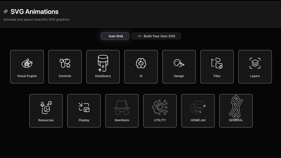
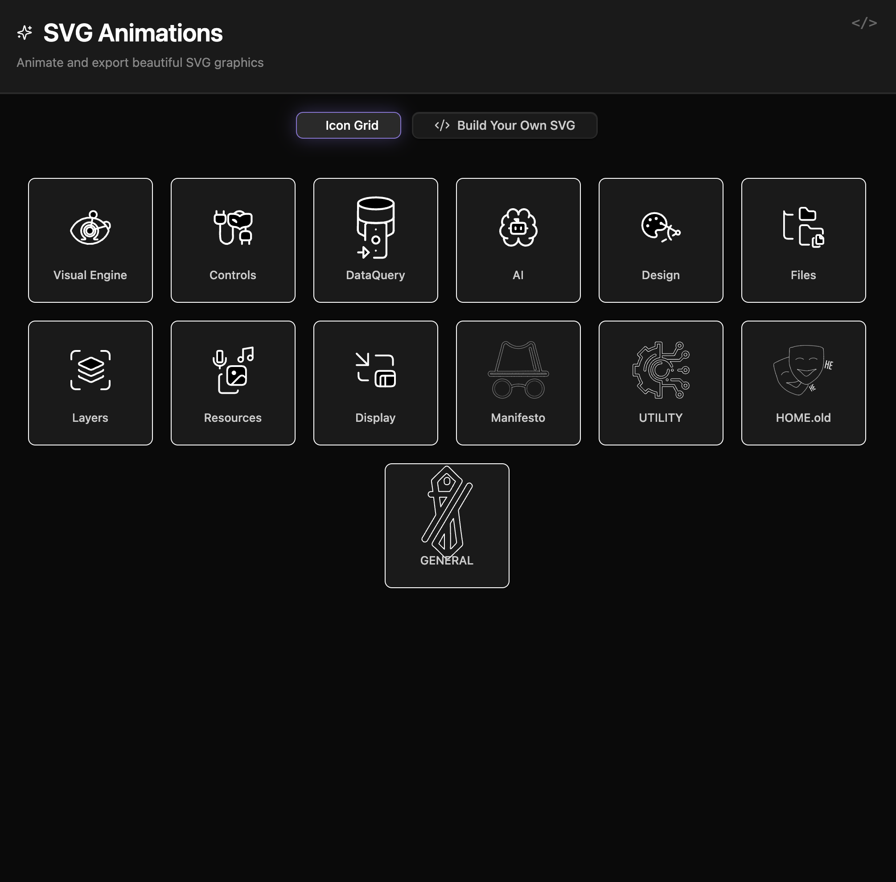

  
  
  <h1 align="center">SVG ANIMATIONS</h1>
  <h3 align="center"> Interactive SVG Showcase and CSS Animation Creator </h3>

  <!-- TOP PURPLE LINKS -->
  
  
  
   
  <!-- BOTTOM GOLD TAXONOMY -->
  
  
  
  

  

    <i> A comprehensive suite for showcasing, building, and exporting CSS-powered SVG animations as standalone files or WebM videos. </i>
  

  

An interactive environment for Obsidian. It features a curated gallery of pre-built line-drawing SVG animations, a custom editor with live previewing, self-animating SVG downloads (CSS automatically embedded inside a `<style>` tag), and high-resolution WebM rendering utilizing Canvg ES modules loaded client-side.

---

## Quick Start

To start trying SVG Animations today:
1. **Download the Repository**: Clone or download this repository directly into any folder inside your Obsidian vault.
2. **Install Datacore**: Ensure you have the **Datacore** plugin installed and enabled in Obsidian.
3. **Open the Entry Note**: Open the **`SVG ANIMATIONS.md`** note inside Obsidian to launch the component!

---

## Features

### Curated Icon Gallery
*   **Interactive Grid**: Displays a grid of animated SVG vector icons that trigger viewport-lazy line-drawing drawing scripts.
*   **Continuous Loop**: Hovering over an icon resets and loops its drawing animation.
*   **Detail Mode**: Clicking an icon opens an overlay view to focus on the animation detail.

### CSS Animation Editor
*   **Split Workspace**: Split editor containing dedicated SVG and CSS textareas to paste, test, and iterate creations in real-time.
*   **Live Rendering**: Instantly preview animation iterations inside a sandbox container.

### Self-Animating & Video Exports
*   **Self-Animating SVG**: Exports custom creations as a single, portable `.svg` file with the animation keyframes automatically embedded within its inner styles.
*   **WebM Timelines Exporter**: Renders vector-based timelines directly into `.webm` video files at high resolutions (720p, 1080p, 1440p) using Canvg ES module triggers.

---

## Directory Index & Components

The package exposes the following compiled files:

| File | Description |
| :--- | :--- |
| **[SVG ANIMATIONS.md](SVG%20ANIMATIONS.md)** | The main entry point designed to be loaded inside Obsidian panes. |
| **[src/index.jsx](src/index.jsx)** | View bootstrapper and cache invalidation daemon. |
| **[src/App.jsx](src/App.jsx)** | Main SVG animator implementation and Canvg video exporter component. |
| **[src/data/icons.js](src/data/icons.js)** | Package array housing pre-built animated SVG definitions. |
| **[data/mcp_commands.json](data/mcp_commands.json)** | Local polling command payload for HMR invalidation. |
| **[METADATA.md](METADATA.md)** | Packaging manifest outlining indexing, target, and security configurations. |
| **[CONTRIBUTION.md](CONTRIBUTION.md)** | Contributor architecture standards and local compilation guidelines. |
| **[LICENSE.md](LICENSE.md)** | MIT open-source license. |
| **[assets/image/preview_1.webp](assets/image/preview_1.webp)** | High-fidelity static preview image of the component. |
| **[assets/videos/preview.gif](assets/videos/preview.gif)** | Walkthrough loop walkthrough GIF. |

---

## Previews

| Card Layout | Interactive Gallery Explorer |
| :---: | :---: |
|  |  |

---

## Contributors
- beto.group
